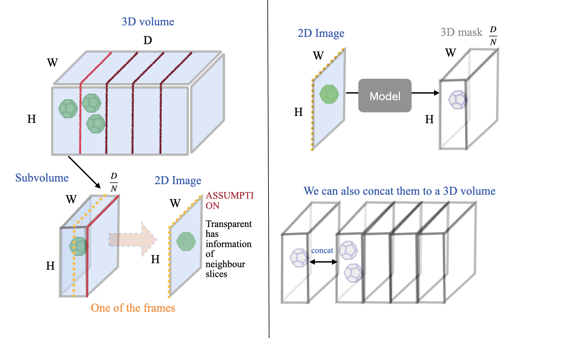

### LabelGen3D

#### Preparing a Dataset for 3-D Mask Generation

> **Objective**
> Train a network that transforms a single, optically-transparent 2-D tissue image into a 3-D segmentation mask.

Because each 2-D frame is translucent, it carries contextual cues from adjacent slices. The model learns to exploit that “built-in” neighbourhood information to reconstruct the underlying 3-D structure.

---

#### 1. Data collection

* Acquire full 3-D image volumes of the specimen.
* Extract 2-D optical frames (e.g., along the *z*-axis). Transparency ensures that every 2-D image already encodes a local stack of tissue.

#### 2. Annotation

* **3-D masks** – We require annotated 3D masks for the model to learn the distribution of target structures. However, since this is a weakly supervised task, 3D masks are not needed for every training volume. 2 or 3 volumes with full 3-D masks are sufficient probbly.
* **2-D masks (optional)** – Annotate selected frames to guide the network and accelerate convergence.

---

#### 3. Sub-volume tiling

A single 2D image cannot capture the full context of an entire 3D volume. Therefore, each volume is split into N overlapping sub-volumes of size

$$
H \times W \times \frac{D}{N}.
$$

For every sub-volume:

1. Take (or generate) the central 2-D slice as the **model input**.
2. The goal is to generate the **corresponding 3D sub-volume mask**.

The figure illustrates this. 

---

#### 4. Model training & reconstruction

After inference, concatenate the predicted sub-volume masks along the depth axis to obtain the full-resolution 3-D mask for the entire specimen.

---

#### Key assumptions & notes

* **Transparency assumption** – Each 2-D image contains enough information about neighbouring slices for the network to infer depth.
* **Overlap & blending** – Overlapping sub-volumes improve continuity; simple averaging or a learned fusion layer can resolve boundary discrepancies.

